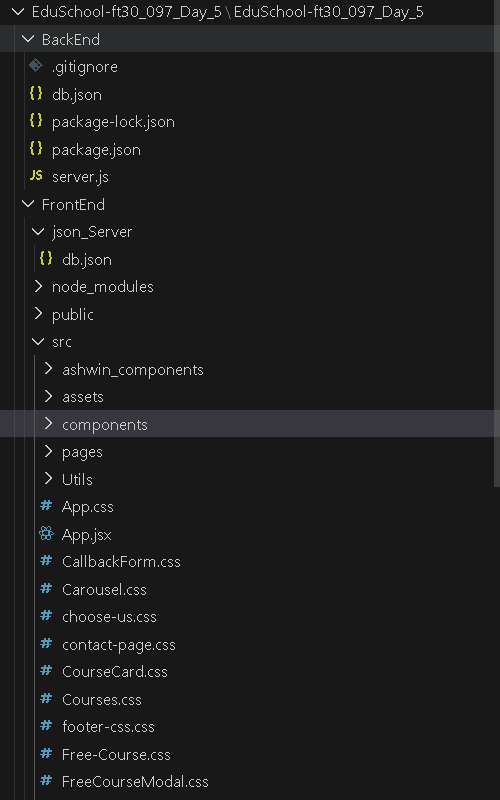
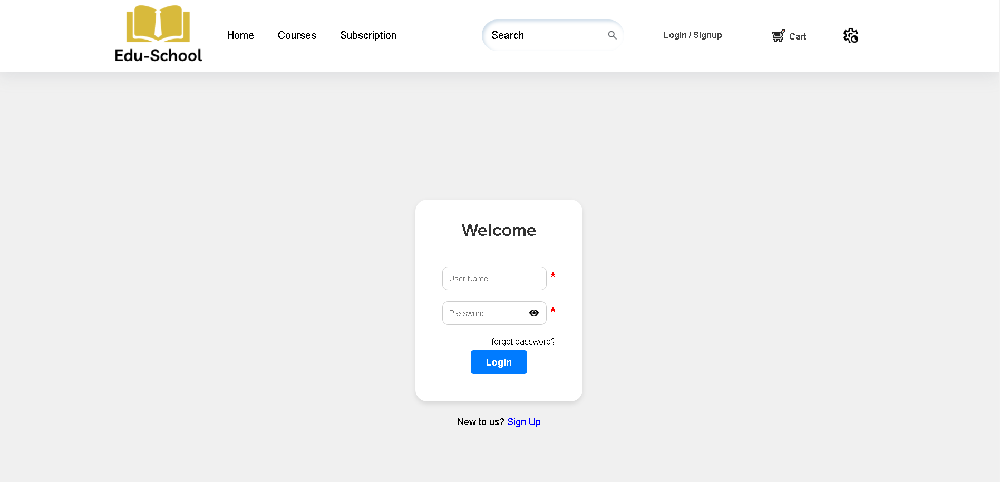
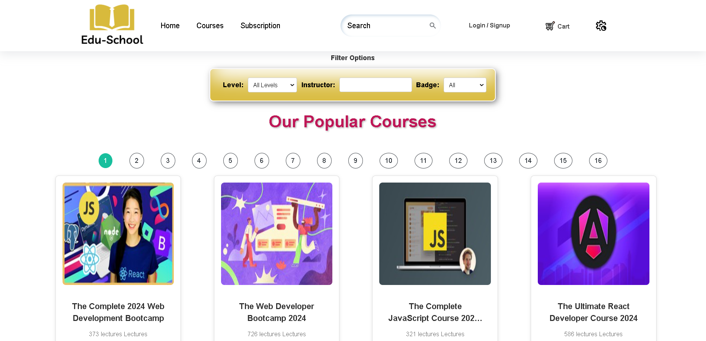
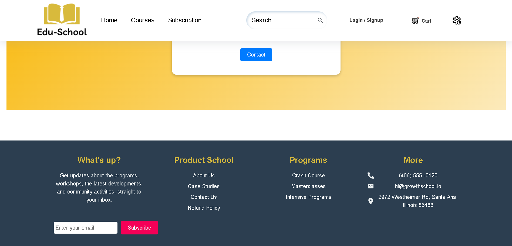
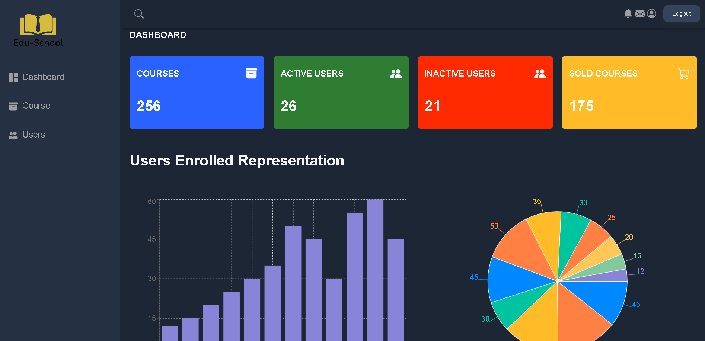

# EduSchool

Edu-School :The EduSchool Course Subscription Plan project aims to create a subscription-based model allowing users unlimited access to courses for a monthly or annual fee. It will include features such as user account management, secure payment integration, and content access control based on subscription status. The project will enhance user experience with personalized dashboards and progress tracking. Analytics and reporting tools will be developed to monitor subscription metrics and user engagement. The goal is to provide flexible learning options and recurring revenue for EduSchool.

### Project Type

Frontend | Backend

### Deployed Link

- EduSchool: [Live Demo](https://edu-school-k4id.vercel.app/)
- Admin DashBoard: [Live Demo](https://edu-school-ka3k.vercel.app/)

### Directory Structure



### video Walkthrough of the project

### Screenshots

**Landing Page**


**Login and Signup Page**



**Course Detail Page**



**Footer**



**Admin Dashboard**



### Features

- **Login and Signup**: "Effortlessly access exclusive deals by logging in or sign up for personalized shopping experiences"
- **Responsive and Dynamic**: The website adapts seamlessly to any device, ensuring a smooth and intuitive experience across desktop, tablet, and mobile.
- **Admin Dashboard (CRUD Operations)**: (For authorized users) Admins can manage the platform effectively with a comprehensive dashboard enabling them to Create, Read, Update, and Delete courses, user accounts, and 
   other critical data.
- **Search bar and Filtering**: Easily find the course you want with our intuitive search bar.
- **Cart**: Keep track of your favourite courses with our convenient cart feature.

 ### Technology Stack

- **HTML**: Provides the structure and content for the web page.
- **CSS**: Handles the UI and styling, ensuring an appealing visual presentation.
- **Javascript**: JavaScript empowers dynamic and interactive web experiences through its versatile scripting capabilities.
- **Json Server**:JSON Server simplifies backend development by allowing you to quickly create a REST API with JSON data, streamlining your development process and enabling rapid prototyping.
- **Bootstrap Library (Bootstrap 5.3)**:Provides responsive designs that adapt to different screen sizes.
- **React.JS**: A JavaScript library for building user interfaces.
- **Chakra UI**: A component library built on top of React.JS.Focuses on simplicity and on performance.

### Design Elements

- **Interactive**: Card will increase in sized in a smooth way when curser hover them.

- **Flex and Grid**: Many of the elements takes the benefits of display flex and display grid to provide more control over the deferent layout in different sections of website.

- **Fonts & Icons**: Integrates React Fonts and React icons for enhanced visual elements. By leveraging these resources, the website achieves a modern and visually appealing design, improving readability and user engagement.

### Installation & Getting started

To run the frontend website, enter the following commands in your terminal:

```bash
#Cloning repository
Clone this repository to your local machine.

# Move into the FrontEnd Directory
cd FrontEnd/

# Install all dependencies
npm install

# Run the dev server
npm run dev
```

The project uses a mock server deployed using JSON-server on render. The server can be accessed here: 

If you would like to run a local server instead, use the following commands:

```bash
# Move into the BackEnd directory
cd BackEnd/

# Run the server
npm run start
```
### Contributors

- [Shobhit Gupta](https://github.com/shobhit9742)
- [JagannathGariNavya](https://github.com/JagannathGariNavya)
- [Ashwin Bhagat](https://github.com/asbhagat2020)
- [Shreya Kushwaha](https://github.com/shreya-kushwaha40)

### Acknowledments

- Inspired by the original EduSchool website.
- Special thanks to our dedicated team for their invaluable contributions to EduSchool, and to our mentor/IA Aditya Kumar

